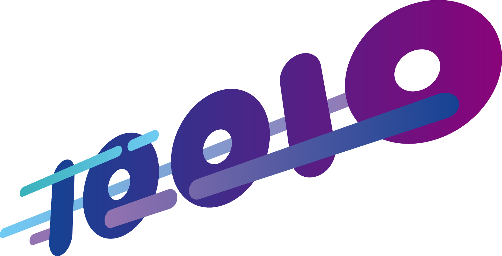

    

# ETAS Developer Summit 2023 on September 28

## What you can expect
- Get a holistic view on modern software development
- Gain new insights and knowledge about developing software and products
- Dive into the spirit of collaboration within the automotive software industry
- Meet the Open Source Communities [Eclipse Foundation](https://www.linkedin.com/company/eclipse-foundation/), [COVESA](https://www.linkedin.com/company/covesa-alliance/) and [SOAFEE](https://www.linkedin.com/company/soafee/) and dig deeper into OSS projects
- Dig deeper in specified topics with experts from ETAS as well as from the Open Source Community and our partners
- Meet like-minded people and expand your network
- Joint coding sessions & calibration challenges
- And last but not least: good food, fun, networking and collaboration

### The following topics await you at our DevOps Cycle:

- Function validation with field data. Shadow Mode. Getting Real-World Data.
- Interactive Measurement and Calibration with µP based VCU (new INCA use case). Measure variables with INCA in an AUTOSAR Adaptive environment.
- 10 Minutes to Wow: experience how to set up your development environment, create your first vehicle application and deploy it to our reference system in 10 minutes.
- Data is King: How to get quality data and insights out of your vehicle? Measure, store, process, and visualize in-vehicle data easily and flexibly.
- Cloud service development and release as easy as it can be. Rapidly and easily create, release, and use a service.
- Anytime, anywhAIR: software lifecycle management over the air. Manage the software life-cycle of your fleet.
- SDV Demonstrator with AUTOSAR Adaptive and Classic inside – a complex vehicle computer setup with the actual and future needs to be covered in modern automobiles with µP based systems.
- Capture the flag: Try to break, compromise or retrieve sensitive information of real-life applications. Understand attackers' mindset order to develop more secure applications.
- Extensions for virtual testing: Hands-on prototypes that introduce new extensions for our virtual testing environment. Experts can discuss them and contribute their ideas and suggestions.
- Help us design products that meet your future needs!

### In our Summit Lab you can get active, we have prepared some challenges for you:

- Capture the Flag - Can you Hack This? Hands on Introduction to CyberSecurity
- Develop a vehicle app in less than 10 minutes with the frame work "Velocitas“
- DIY - Develop It Yourself: Create a cloud-based service
- Try it out: Easily measure and manage data in the cloud
- AOS Forensic UseCase
- digital.auto: software-defined vehicle hack challenge

### Discuss hot topics with our experts on site:

- COVESA Vehicle Signal Specification (VSS / VSC) enabling interoperability - [Christoph Ludewig (Geotab GmbH)](https://www.linkedin.com/in/christophludewig/)
- Certified Rust Compiler - [Florian Gilcher (Ferrous Systems GmbH)](https://www.linkedin.com/in/floriangilcher/)
- Containers on Wheels - [Pierre-Yves Chibon (Red Hat)](https://www.linkedin.com/in/pierreyveschibon/)
- Fearless AD Software development with Rust - [Arnaud Riess (Robert Bosch GmbH)](https://www.linkedin.com/in/arnaud-riess/)
- FleetManagementService (FMS) blueprint leveraging Eclipse SDV - Kai Hudalla (Robert Bosch GmbH)
- Eclipse LEDA - [Mike Haller (ETAS GmbH)](https://www.linkedin.com/in/mhaller/)
- Virtual Development – Fergus Duncan (Capgemini)
- SOAFEE architecture – [Andreas Achtzehn (Robert Bosch GmbH)](https://www.linkedin.com/in/achtzehn/)
- Safe Linux - [Philipp Ahmann, Robert Bosch GmbH & Chair ELISA Working Groups Linux Foundation](https://www.linkedin.com/in/philipp-ahmann/)
- Cryptography on CAN – [Ken Tindell (JK Energy Ltd.)](https://www.linkedin.com/in/kentindell/)

# Don't miss the event